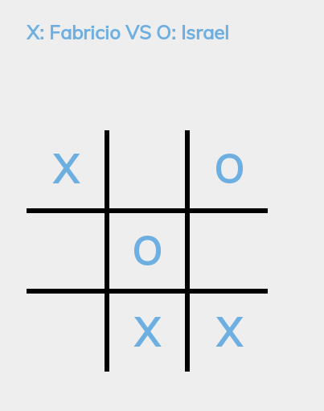
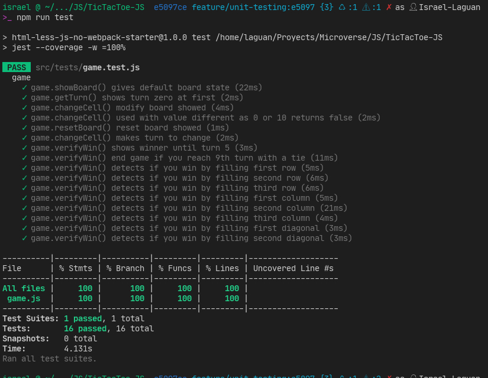

<!-- PROJECT SHIELDS -->
<!--
*** "reference style" links are used for readability.
*** Reference links are enclosed in brackets [ ] instead of parentheses ( ).
*** See the bottom of this document for the declaration of the reference variables
*** for contributors-url, forks-url, etc. This is an optional, concise syntax you may use.
*** https://www.markdownguide.org/basic-syntax/#reference-style-links
-->

[![Contributors][contributors-shield]][contributors-url]
[![Forks][forks-shield]][forks-url]
[![Stargazers][stars-shield]][stars-url]
[![Issues-open][issues-open-shield]][issues-open-url]
[![Issues-closed][issues-closed-shield]][issues-closed-url]

<!-- PROJECT LOGO -->
 

  

  <h1 align="center">
	Tic Tac Toe
  </h1>

  

    A Tic Tac Toe game you can play in your browser! created with JS
     
	  🖊️
    <a href="https://www.theodinproject.com/courses/javascript/lessons/tic-tac-toe-javascript">Assigment</a>
    🐞
    <a href="https://github.com/Israel-Laguan/TicTacToe-JS/issues">Report a Bug</a>
    🙋‍♂️
    <a href="https://github.com/Israel-Laguan/TicTacToe-JS/issues">Request Feature</a>
  

# Specifications

- Data Structures
- Object Oriented Programming
- Factory Functions
- Module Pattern
- Export/import ES6+ notation

# Features

- Basic VanillaJS app with a single script or few commands
- JS modules and ES6+ available for most browsers
- Sets `stickler` on the repo
- Sets `eslint` rules
- Tests made with [`ESLint`](https://eslint.org/)
- Unit Testing with [`Jest`](https://jestjs.io/)
- Add `jest` and `eslint` to be callable with `npm`

# Tests

## `ESlint`

## `Jest`

# Built With

- `LESS`
- `ESLint`
- `npm`
- `vscode` with _ESLint_ extension
- Linux/GNU
- Love and Passion for code

# Live Demo

[Link](https://raw.githack.com/Israel-Laguan/TicTacToe-JS/685a73692cfe12b597d806636ed956cad2393b63/index.html)

# Authors

👨 [Fabricio Garcia](https://github.com/fabricio-garcia)\
<table style="width:100%">
  <tr>
    <td>
        

            
            <h2>
                <a href="https://israel-laguan.github.io/" target="_blank" rel="author">
                    Israel Laguan
                </a>
            </h2>
        

    </td>
    <td>
        

            <a href="mailto:israellaguan@gmail.com" target="_blank" rel="author">
                
                <h3>
                    Email me to 
                    <a href="mailto:israellaguan@gmail.com">
                        israellaguan@gmail.com
                    </a>
                </h3>
            </a>
            <a href="https://www.linkedin.com/in/israellaguan/" target="_blank" rel="author">
                
                <h3>
                    Connect to my Linkedin
                </h3>
            </a>
            <a href="https://github.com/Israel-Laguan" target="_blank" rel="author">
                
                <h3>
                    Check my GitHub Profile
                </h3>
            </a>
        

    </td>
  </tr>
</table>

# 🤝 Contributing

Contributions, issues and feature requests are welcome!

# 🤗 Show your support

Give a ⭐️ if you like this project!

# 🏅 Acknowledgements

Give a ⭐️ if you like this project!

- [Microverse](https://www.microverse.org/)
- [The Odin Project](https://www.theodinproject.com/)

# 📝 License

This project is licensed under the Apache License 2.0\
Feel free to fork this project and improve it

<!-- MARKDOWN LINKS & IMAGES -->
<!-- https://www.markdownguide.org/basic-syntax/#reference-style-links -->

[contributors-shield]: https://img.shields.io/github/contributors/Israel-Laguan/TicTacToe-JS?style=plastic
[contributors-url]: https://github.com/Israel-Laguan/TicTacToe-JS/graphs/contributors
[forks-shield]: https://img.shields.io/github/forks/Israel-Laguan/TicTacToe-JS?style=plastic
[forks-url]: https://github.com/Israel-Laguan/TicTacToe-JS/network/members
[stars-shield]: https://img.shields.io/github/stars/Israel-Laguan/TicTacToe-JS?style=plastic
[stars-url]: https://github.com/Israel-Laguan/TicTacToe-JS/stargazers
[issues-open-shield]: https://img.shields.io/github/issues/Israel-Laguan/TicTacToe-JS?style=plastic
[issues-closed-url]: https://github.com/Israel-Laguan/TicTacToe-JS/issues
[issues-closed-shield]: https://img.shields.io/github/issues-closed/Israel-Laguan/TicTacToe-JS?style=plastic
[issues-open-url]: https://github.com/Israel-Laguan/TicTacToe-JS/issues
